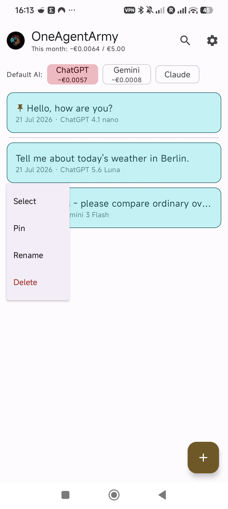
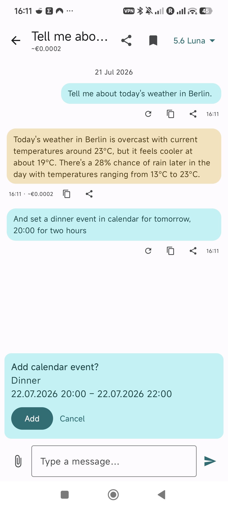
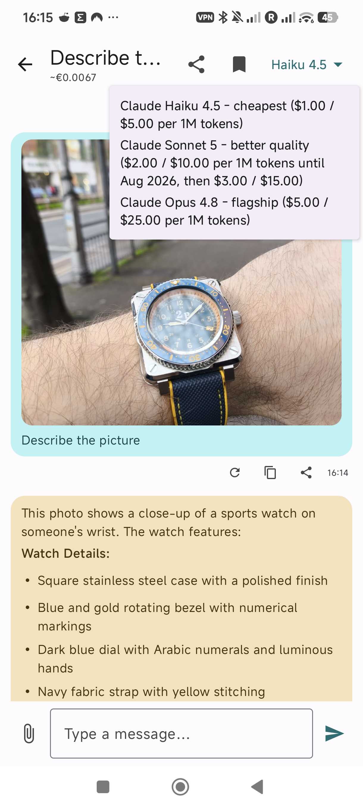
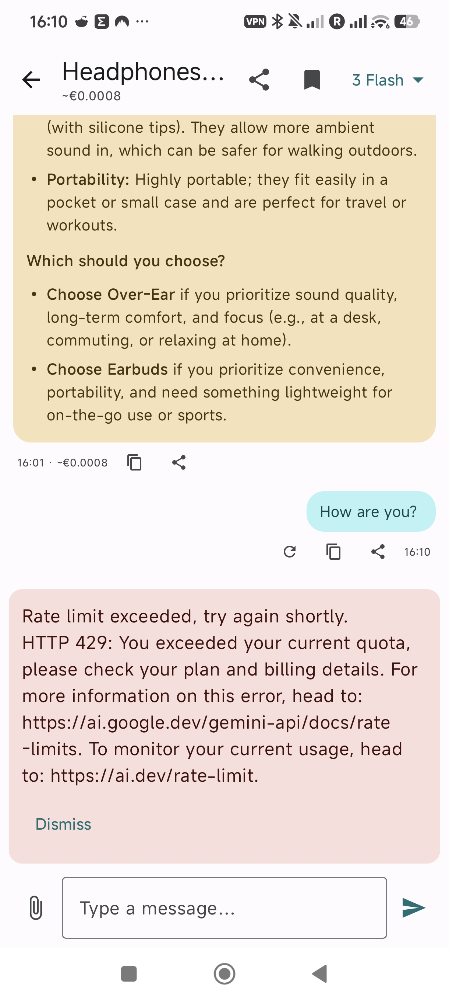
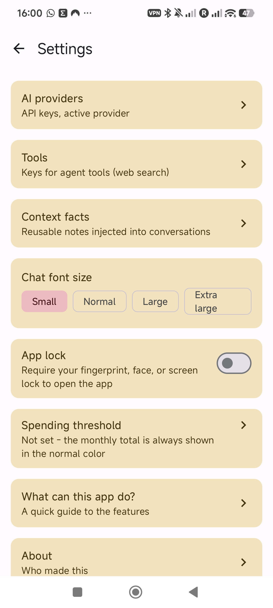
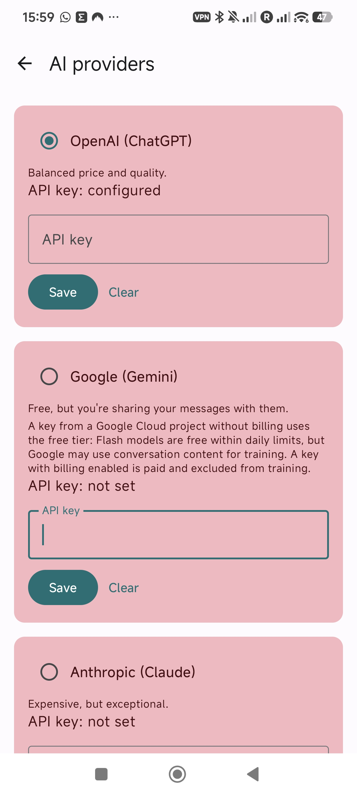
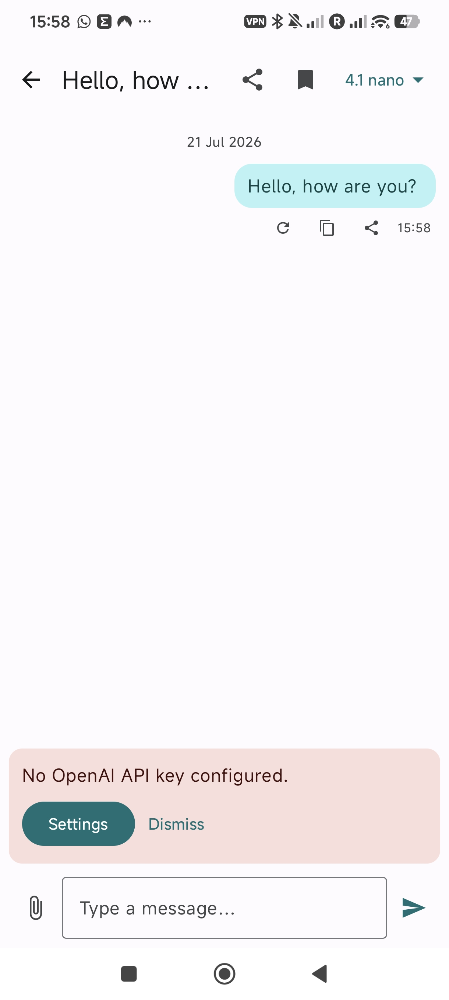

# OneAgentArmy


A personal AI chat client for Android that talks directly to LLM provider APIs — pay per use instead of paying for a subscription you barely touch.

Built as a private app for personal use. The code is public so it can serve as a reference / portfolio piece, but there are no secrets in this repo — API keys are entered by the user at runtime and stored encrypted on-device.

## Why

Most AI chat subscriptions bundle a flat monthly fee regardless of actual usage. OneAgentArmy skips the middleman: it calls OpenAI, Google Gemini, and Anthropic Claude directly with your own API key, so you only ever pay for the tokens you actually use — while keeping one consistent chat UI across all three.

## Screenshots

<table>
<tr>
<td><br><sub>Conversation list — pinned chats, per-provider monthly cost, quick actions</sub></td>
<td><br><sub>Weather lookup + one-tap calendar event, confirmed before anything happens</sub></td>
</tr>
<tr>
<td><br><sub>Photo analysis, with per-conversation model switching</sub></td>
<td><br><sub>Markdown rendering, and errors surfaced clearly instead of failing silently</sub></td>
</tr>
<tr>
<td><br><sub>Settings — providers, tools, spending threshold, app lock</sub></td>
<td><br><sub>Optional biometric/PIN app lock</sub></td>
</tr>
<tr>
<td><br><sub>Bring your own API keys, per provider</sub></td>
<td><br><sub>Clear guidance when something's missing</sub></td>
</tr>
</table>

## Features

- **Three AI providers, one app** — OpenAI (Responses API), Google Gemini (Interactions API), and Anthropic Claude (Messages API), each with three model tiers (cheap / mid / flagship). Every conversation remembers its own model, independent of whichever provider is set as the app-wide default for new chats.
- **Remotely updatable model catalog** — model lists and prices live in [models.json](models.json) in this repo; the app fetches it on demand (Settings → AI providers → Refresh) and caches the result, so a deprecated model or a price change is fixed by editing one JSON file on GitHub — no new APK needed. Compiled-in defaults remain as the offline fallback.
- **Tool calling** — two flavors:
  - Client-side tools with a confirmation card: calendar events, alarms, timers, SMS drafts, navigation, notes. Nothing is sent until you tap confirm, and the tool-call turn itself never touches local storage.
  - Transparent, provider-side round-trips: live weather (Open-Meteo) and web search, invisible to the rest of the app.
- **Hosted web search toggle** — switch between each provider's built-in web search and a Tavily-backed fallback, per your preference; not every model supports hosted search, so the app degrades gracefully where it doesn't.
- **Multimodal attachments** — paste in text/CSV files inline, or attach real photos and PDFs (capped at 5 MB) as native multimodal blocks, images auto-scaled to keep costs sane.
- **Rolling conversation context** — every message carries the last N messages of that conversation (20 by default), so the model remembers what was said. That also means an attached file or photo is silently resent (and re-billed) on every follow-up until it ages out of that window. The window size is configurable in Settings, with a per-conversation override for chats you want to keep more (or less) context in.
- **Cost tracking** — every AI reply shows an estimated cost in EUR (daily ECB exchange rate, no API key required), with running totals per conversation, per month, and broken down per provider. Set a monthly spending threshold and the total turns red once you cross it.
- **Configurable request timeout** — reasoning models can think for minutes; how long to wait before cancelling is settable (m:ss format, default 4:00, max 15:00). While waiting, the chat shows an elapsed timer, and a genuine timeout is reported as such — not misdiagnosed as a lost internet connection.
- **App lock** — optional biometric/PIN/pattern gate before the app opens; re-locks every time it goes to the background.
- **Backup-aware** — conversation history rides along with Android's normal automatic backup; saved API keys are deliberately excluded (a Keystore-backed key never migrates between devices anyway), so you just re-enter them after a restore instead of ending up with dead ciphertext.
- **Pinning & smart sorting** — pin the conversations you're actively using; everything else sorts by most recent message, not creation date.
- **Full-text search** across all conversations, with matches deep-linking straight to the message.
- **Sharing** — send a single reply or a whole conversation transcript through the native Android share sheet.
- **Facts & personalization** — save durable facts about yourself once, attach them to conversations that should know about them, and adjust the chat font size to taste.
- **Persistent drafts & screen restore** — an unsent message (and any staged attachment) is saved automatically and survives the app being backgrounded, locked, or killed by the system; reopening the app returns to whichever screen you were last on instead of the conversation list.
- **Material 3 theming** built entirely from the app icon's own palette, with a searchable in-app help screen covering all of the above.

## Tech stack

- Kotlin + Jetpack Compose (Material 3), MVVM + Repository pattern
- Manual dependency wiring — no DI framework, composition root lives in `AppContainer.kt`
- Room for local persistence (conversations, messages, facts), with additive-only migrations
- OkHttp + kotlinx.serialization — raw HTTP against each provider's REST API rather than an official SDK, so all three providers follow one consistent internal pattern
- DataStore Preferences for settings; API keys encrypted with Android Keystore (AES-256-GCM)
- `androidx.biometric` for the optional app-lock gate
- JUnit 4 + OkHttp MockWebServer for unit tests, AndroidX Test for instrumented tests
- `minSdk 33`

## Project layout

```
app/src/main/java/com/parrotworks/oneagentarmy/
├── AppContainer.kt              # composition root — manual DI
├── data/                        # Room entities/DAOs, repositories, DataStore
├── model/                       # domain models
├── provider/ai/                 # one package per provider (openai/gemini/anthropic) + shared tool registry
├── tools/                       # client-side confirmation-card tools (calendar, alarms, SMS, ...)
└── ui/                          # Compose screens, per feature (chat, conversationlist, settings, search)
```

## Testing

- **Unit tests** (`app/src/test`) — pure JVM, no emulator or device needed. Each provider's HTTP client (`OpenAiApiClient`, `GeminiApiClient`, `AnthropicApiClient`) is exercised against [OkHttp MockWebServer](https://github.com/square/okhttp/tree/master/mockwebserver) through a redirecting `Interceptor` (the clients hardcode their real endpoint, so a test-only interceptor rewrites the destination instead of touching production code) — covers request shape, response parsing, and every HTTP error path (401/403/429/500/no connectivity), with zero real network calls and zero API cost. Also covers pricing/model-registry invariants and small utility functions (cost formatting, search normalization).
- **Instrumented tests** (`app/src/androidTest`) — need a real Android runtime, but an emulator is enough; no physical device required. Currently covers the AES-GCM round-trip through the real Android Keystore.

Run from Android Studio (right-click the `test`/`androidTest` source folder → Run), or `./gradlew test` / `./gradlew connectedAndroidTest` from the command line.

## Getting started

This is a personal project, not a published app — there's no build pipeline or Play Store listing to point at. To run it yourself:

1. Open the project in Android Studio (AGP 9 / Kotlin, no extra Kotlin plugin needed — it ships built into AGP 9).
2. Build and install on a device or emulator running API 33+.
3. On first launch, open Settings and paste in your own API key(s) for whichever provider(s) you want to use. Keys never leave the device except as Authorization headers to that provider's API.

## Status

Actively evolving, one small staged branch at a time. See commit history for what's shipped.

---

ParroT woRKs by Piotr Paterek
